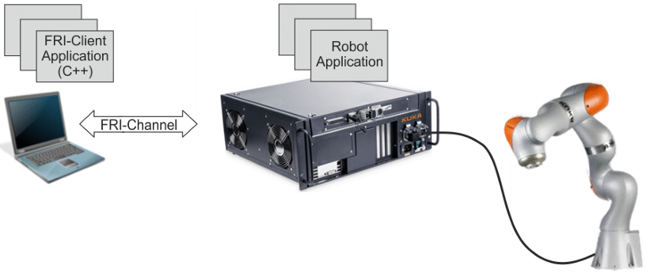
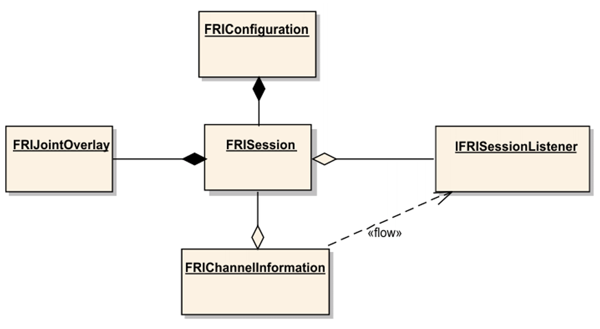
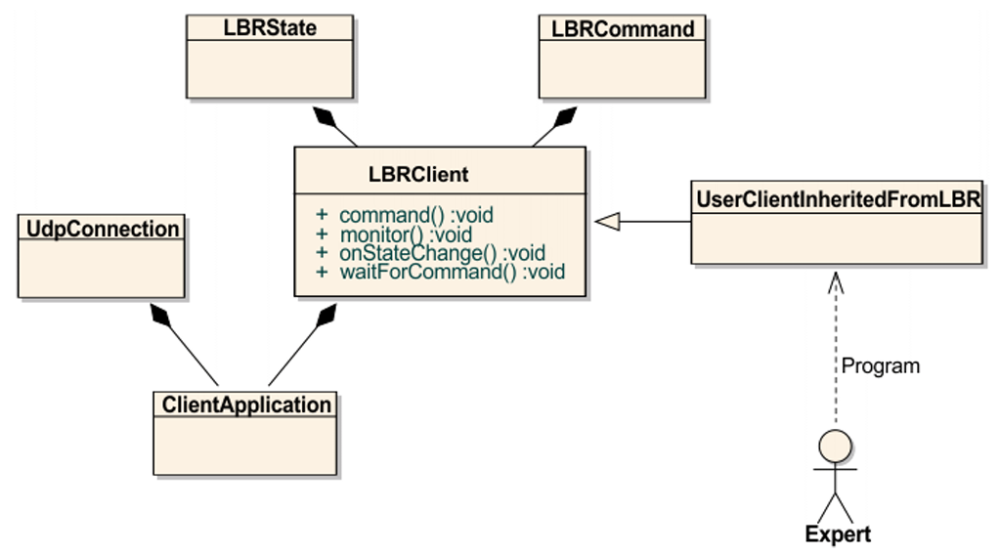
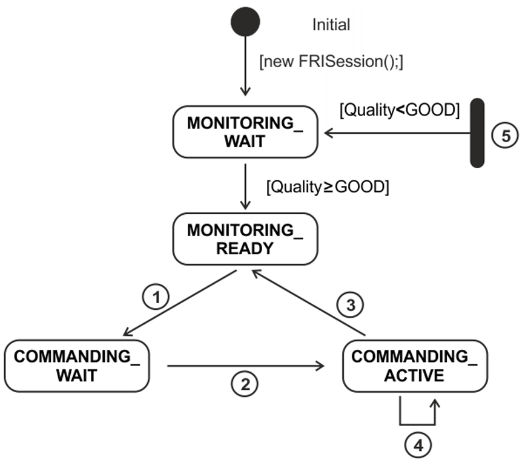
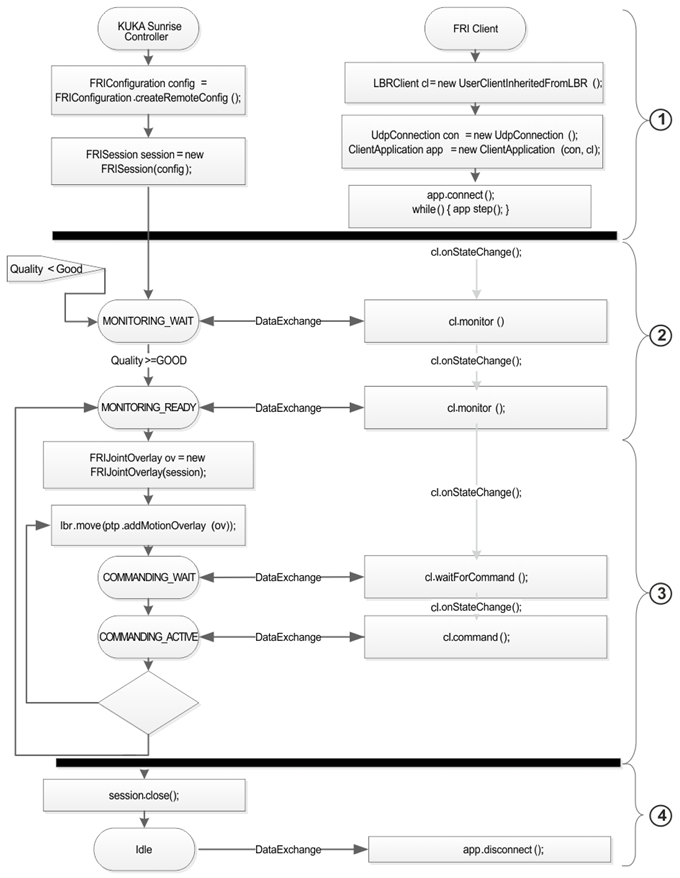
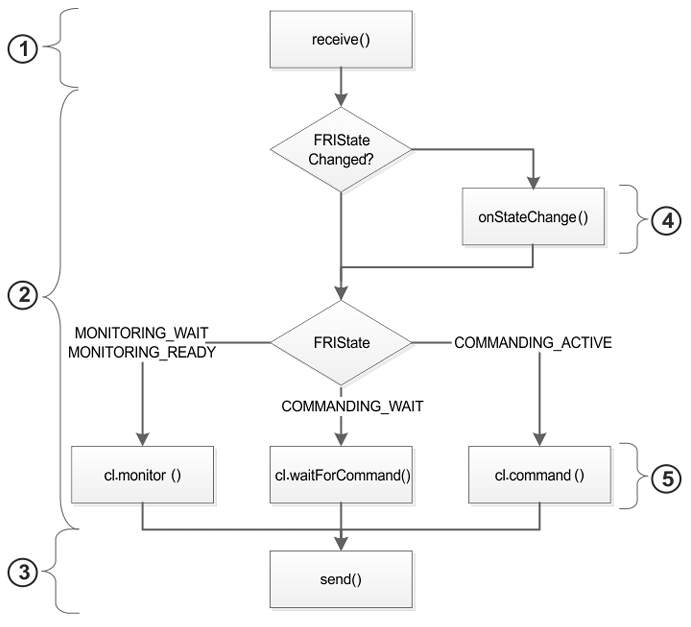

# KUKA Sunrise.FRI

## Overview

FRI is an interface via which data can be exchanged continuously and in real time between a robot application on the robot controller and an FRI client application on an external system. The real-time capability provides the FRI client application with fast cyclical access to the robot path at millisecond intervals. (Page 9)

<figure>
    

    <figcaption align = "center"><b>Fig.2-1: Overview of application development with FRI</b></figcaption>
</figure>

| Type                   | Programming | Description                      | Functionalities                                                                                                                                                                                                                                                                                                                                   |
| ------------------------ | :-----------: | ---------------------------------- | --------------------------------------------------------------------------------------------------------------------------------------------------------------------------------------------------------------------------------------------------------------------------------------------------------------------------------------------------- |
| Robot Application      |    Java    | executed on the robot controller | 1. Sequence control for the robot.  2. Management of coordinate systems, objects and motions.  3. Programming interface for integration of external libraries and functionalities.  4. Configuration and management of various FRI channels.  5. Activation of access by FRI client applications to selected motion sections. |
| FRI-Client Application |     C++     | executed on an external system   | 1. Evaluation of the robot data in real time.  2. Continuous evaluation of the application states in real time.  3. Path superposition under real-time conditions.                                                                                                                                                                      |
| FRI-Channel            |             | UDP interface                    | 1. Binary data exchange.  2. Management via the robot controller.  3. Recording of the effective cycle time for monitoring the connection quality and real-time capability.                                                                                                                                                             |

### Robot Application

The following classes are provided for using the FRI in the robot application (Page 13):

<figure>
    

    <figcaption align = "center"><b>Fig.2-4: Overview of classes</b></figcaption>
</figure>

* The class **FRIConfiguration** enables the configuration of the FRI connection.
* The configured FRI connection is initialized and opened using the class **FRISession**. This causes automatic activation of Monitor mode.
* The class **FRIChannelInformation** can be used to poll the state of the FRI connection.
* The class **IFRISessionListener** provides a notification mechanism which can be used to automatically record all changes of state.
* The class **FRIJointOverlay** enables the activation of Command mode.

### FRI-Client Application

The following classes are provided for application development in the FRI client:

<figure>
    

    <figcaption align = "center"><b>Fig.2-5: Overview of classes</b></figcaption>
</figure>

* The class **LBRClient** provides the interface methods for the Monitor and Command modes. Separate calculation specifications for path observation and superposition are programmed in a class derived from **LBRClient**.
* The class **LBRState** provides the current robot data.
* The class **LBRCommand** provides the command interface to the robot.
* The class **UDPConnection** encapsulates the UDP connection.
* The class **ClientApplication** links communication and calculation specifications.

### Communication between the robot controller and FRI client

#### Interaction between Monitor mode and Command mode

The following FRI states are controlled by the robot controller:

* **MONITORING_WAIT**: The robot controller has opened the FRI connection and is waiting for realtime-capable data exchange.
* **MONITORING_READY**: The robot controller is performing real-time-capable data exchange with the FRI client application. It is possible to switch to Command mode in the MONITORING_READY state. The change is initiated in the robot application if a motion with path superposition is called.
* **COMMANDING_WAIT**: The robot controller initializes the motion to be superposed and synchronizes itself with the FRI client.
* **COMMANDING_ACTIVE**: The robot controller applies the values specified by the FRI client application for superposing the robot path.

<figure>
    

    <figcaption align = "center"><b>Fig.2-3: Interaction between Monitor mode and Command mode</b></figcaption>
</figure>

#### Application development in the FRI client

In the FRI client application, the FRI states are mapped directly to callback methods of the class **LBRClient** or  classes derived from this:

* **MONITORING_WAIT** corresponds to cl.monitor();
* **MONITORING_READY** corresponds to cl.monitor();
* **COMMANDING_WAIT** corresponds to cl.waitForCommand();
* **COMMANDING_ACTIVE** corresponds to cl.command();
* State transitions are mapped with cl.onStateChange();

<figure>
    

    <figcaption align = "center"><b>Fig.2-6: Communication between the robot controller and FRI client</b></figcaption>
</figure>

1. Configuration and opening of the FRI connection
2. Monitor mode
3. Command mode
4. Closing the FRI connection and ending the FRI application

##### app.step() method

During communication between the FRI client and robot controller, the method **app.step()** is executed cyclically in the FRI client application at the configured send rate.

The method **app.step()** comprises the data exchange with the robot controller and the call of the callback methods which correspond to the current FRI state. The user can change the system behavior with these callback methods. The callback methods are implemented via derivation from the class **LBRClient**.

<figure>
    

    <figcaption align = "center"><b>Fig.2-7: Procedure within the method app.step()</b></figcaption>
</figure>

1. Receipt and preparation of the message
2. Evaluation of the current FRI state and calculation of new specified values via calling of callback methods
3. Sending of message including preparation of the message
4. Callback - Reaction to change of FRI state
5. Callback - Cyclical calculations in different FRI states

## Intended Use

KUKA Sunrise.FRI is used for tapping new areas of use, applications and algorithms for the LBR iiwa. FRI may only be used during development by trained personnel in supervised operation. (Page 17)
