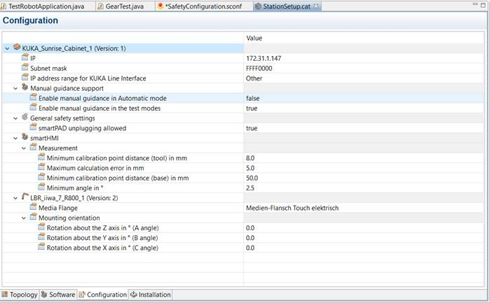
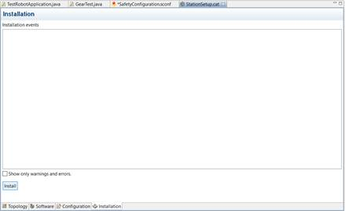
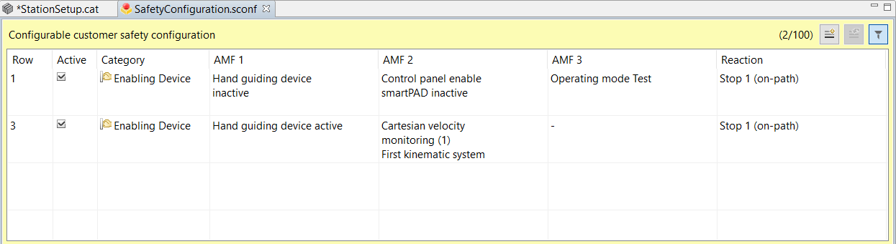
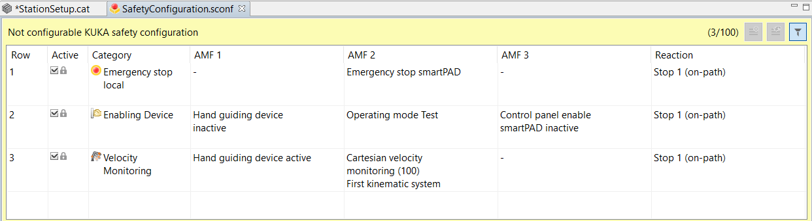
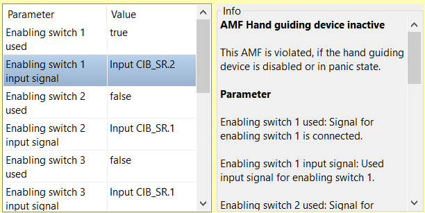
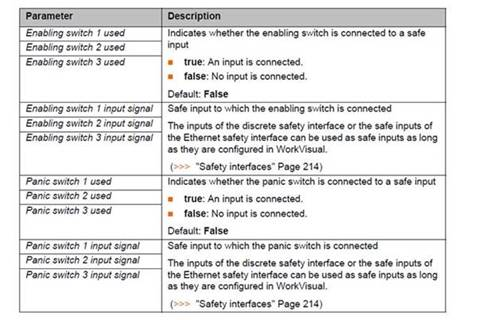
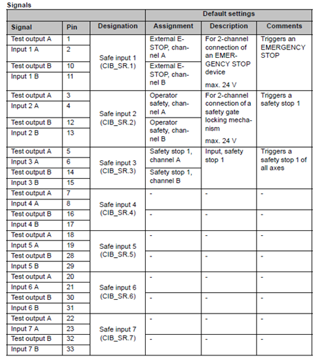
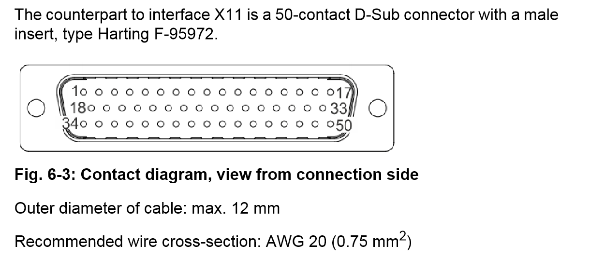

# RoboDK Driver for KUKA iiwa robots

This folder has nothing to do with ROS.

## Prerequisite

### Handguiding Project Setup

If you want to hand-guide the robot with an external switch, you need:

* A Double Pole Single through Switch
* Human robot collaboration option package installed and selected in project
  via stationSetup.cat file | **software tab**

### Instructions (Sunrise Workbench)

1. Change the Setup Configuration to allow for hand guiding

   * Set Enable manual guidance in Automatic mode to false
   * Makesure to change your media Flange to the correct type on your robot

   <figure>
    <p align="center"></p>
    </figure>

   * Use the installation tab in the stationSetup.cat file to reinstall the station setup

   <figure>
   <p align="center"></p>
   </figure>
2. Create Permanent Safety Monitoring (PSM) function in the safety configuration | **Customer PSM tab**

   * Setup an Atomic Monitoring Function (AMF) to monitor the handguiding enabling switch
   * Response should be STOP 1 (ON-PATH)

   <figure>
    <p align="center"></p>
    </figure>

   * You can also change the velocity constraint in the **KUKA PSM tab**

   <figure>
    <p align="center"></p>
    </figure>

   > Tip: Chapter 15.9 of the SI manual says that if a non-path-maintaining stop reaction is configured for the AMF Hand guiding device enabling inactive, the robot must first be repositioned following manual guidance before the application can be resumed. Therefore, please configure any hand guiding devices to stop 1 (on-path) reactions.
   >
3. Setup signal parameters for the Customer PSM AMF

   * Update the Hand guiding device inactive monitoring parameters  in the safety configuration to the following. **You can check the X11 pin layout in the cabinet manual to determine what CIB_SR you want to use and what Pins they correlate too.**

   <figure>
    <p align="center"></p>
    </figure>

   * If you have a panic switch on your external button please configure that as well. Most will not configure this for an external switch.
   * More details can be found in IS 1.13 page 245, 1.11 page 237. (Parameter details below)

   <figure>
    <p align="center"></p>
    </figure>
4. On the physical side please use a double pole single throw switch to create a circuit that connects the correct inputs. If you are using the X11 connector, please reference the following table.  **NOTE THAT THE PIN LAYOUT BELOW FOR THE X11 IS FOR THE INTERFACE ON THE CABINET NOT THE CONNECTING BUS CONNECTOR.**

   <figure>
    <p align="center"></p>
    <p align="center"></p>
    </figure>

   * For example, if you follow the example and use CIB_SR.4 you will need a 20 AWG (Please check details with KUKA manual to confirm). Connect pins 7 to pin 8 and pin 16 to pin 17 using the 2 pole switch and circuit you design. You will need a pole for each input.
   * Check that 24V DC is being outputted from output pins.
   * Your switch should include a **DPST type switch** (if you desire to use the panic aspect of the enable switch you will need a 3 phase button, e.g. on-off-on)
5. Please first test hand guiding in T1 mode. It should allow you to motion the robot when the enabling switch is triggered.
6. Create a simple code to test the handguiding feature. See [example code](#example-code) section for an example.
7. Synchronize the project onto the controller. It will ask for a reboot of the controller because you made safety configuration changes.

### Hardware

The handguiding setup needs a DPDT enabling switch because it is being incorporated into the safety connection interface X11 on the cabinet. You will need to wire two test connections to use these safety pins. For example, a 24V dc signal will come from Test output A and Test output B (controller supplied) and need to be connected to Input 1 A and Input 1 B, respectively. The external switch would be between these connections. Then in your safety Configuration file you would set the enabling button to your CIB_SR.1 and do the same for a panic switch if so desired.
If you desire to implement your enabling switch on your end effector you will need to utilize the ethernet and power connecting wires at the media flange. The following diagrams show the connection pins for the media flange and base connector.

## Setup RoboDK

1. Deploy the [DriverRoboDK.java](/iiwa_robodk/Sunrise/DriverRoboDK.java) to the Sunrise Controller
2. Load the RoboDK Driver from RoboDK
   * If no driver exists, copy the [apikukaiiwa.py](/iiwa_robodk/RoboDK/apikukaiiwa.py) to RoboDK installation directory
3. Open [example.rdk](/iiwa_robodk/example.rdk) from RoboDK or add a new program with a Pause Instruction, you can rename it to e.g. HandGuiding
4. Right-click the program and select "Run on Robot"
5. Run the DriverRoboDK Application on KUKA controller from the SmartPad
6. Connect the Robot from RoboDK, run the Pause Instruction
7. Done!

## Example Code

```Java
package exampleApplications;


import javax.inject.Inject;
import com.kuka.roboticsAPI.applicationModel.RoboticsAPIApplication;
import com.kuka.roboticsAPI.controllerModel.Controller;
import com.kuka.roboticsAPI.deviceModel.LBR;
import com.kuka.roboticsAPI.motionModel.HandGuidingMotion;
import com.kuka.roboticsAPI.uiModel.ApplicationDialogType;

import static com.kuka.roboticsAPI.motionModel.HRCMotions.*;

import static com.kuka.roboticsAPI.motionModel.BasicMotions.*;

import com.kuka.med.controllerModel.MedController;
import com.kuka.med.deviceModel.LBRMed;

/**
 * Implementation of a robot application.
 * <p>
 * The application provides a {@link RoboticsAPITask#initialize()} and a 
 * {@link RoboticsAPITask#run()} method, which will be called successively in 
 * the application lifecycle. The application will terminate automatically after 
 * the {@link RoboticsAPITask#run()} method has finished or after stopping the 
 * task. The {@link RoboticsAPITask#dispose()} method will be called, even if an 
 * exception is thrown during initialization or run. 
 * <p>
 * <b>It is imperative to call <code>super.dispose()</code> when overriding the 
 * {@link RoboticsAPITask#dispose()} method.</b> 
 * 
 * @see UseRoboticsAPIContext
 * @see #initialize()
 * @see #run()
 * @see #dispose()
 */
public class HandguidingDemoMed1.15 extends RoboticsAPIApplication {
	@Inject
	private Controller medController;
	private LBR _lbr;
	private static final double [] JOINT_LIMITS_MAX  =  {Math.toRadians(100),Math.toRadians(100),Math.toRadians(100),Math.toRadians(100),Math.toRadians(100),Math.toRadians(100),Math.toRadians(100)};
	private static final double [] JOINT_LIMITS_MIN = {Math.toRadians(-100),Math.toRadians(-100),Math.toRadians(-100),Math.toRadians(-100),Math.toRadians(-100),Math.toRadians(-100),Math.toRadians(-100)};
	private static final double JOINT_VELOCITY_LIMIT = 3;
	private static final double CART_VELOCITY_LIMIT = 100;

	private int ret;
	private HandGuidingMotion _handguiding = new HandGuidingMotion();
	@Override
	public void initialize() 
	{
		medController = 		(MedController) getContext().getControllers().toArray()[0];
        _lbr = 					(LBR) medController.getDevices().toArray()[0];
  
        _handguiding = new HandGuidingMotion();
//        _handguiding = handGuiding();
        _handguiding.setJointLimitsMax(JOINT_LIMITS_MAX);
        _handguiding.setJointLimitsMin(JOINT_LIMITS_MIN);
        _handguiding.setJointVelocityLimit(JOINT_VELOCITY_LIMIT);
        _handguiding.setJointLimitViolationFreezesAll(false);
        _handguiding.setCartVelocityLimit(CART_VELOCITY_LIMIT);
   
	}

	@Override
	public void run() 
	{

		while(ret!=2)
		{
			ret = getApplicationUI().displayModalDialog(ApplicationDialogType.QUESTION, "Option?", "Param", "Default", "Exit");
			switch(ret)
			{
			case 0:
				_lbr.move(_handguiding);
				getLogger().info("Handguiding with Params");
				break;

			case 1:
				getLogger().info("Default Core-Handguiding");
				_lbr.move(handGuiding());
				break;

			case 2:
				getLogger().info("Exit App");
				break;
			}

		}
	}
}
```

## Understanding the Logic

In the application, motions before and after manual guidance are generally required. It is advisable to monitor each of these motions using an ESM state which does not evaluate the signal on the hand guiding device, and to only switch to the ESM state for the manual guidance motion directly before switching to Manual guidance mode.

If this is carried out in the application in this manner, the response
is as follows:

* If the signal for manual guidance is issued before Manual guidance mode
  is switched on in the application, Manual guidance mode will be
  active as soon as it is switched on. This means that the application
  is not paused when the mode is switched on, making for a smooth
  transition between Application mode and Manual guidance mode.

  * Precondition for this response: the application velocity is less than the maximum permissible velocity configured for manual guidance. ("Velocity monitoring during manual guidance" )
* If the application is executed at a higher velocity, the application is
  paused before switching to manual guidance mode. (Then release the
  enabling switch, press the Start key and wait until the application
  is paused again.)
* If the signal for manual guidance is first issued when Manual guidance
  mode is already switched on in the application, the Start key must
  be pressed in order to manually guide the robot. The pause in the
  application allows the operator to move his hand to the hand guiding
  device.
* Manual guidance mode has ended when the signal for manual guidance has been cancelled, e.g. by releasing the enabling switch. The application is
  paused and can only be resumed by pressing the Start key. The pause
  in the application allows the operator to remove his hand from the
  hand guiding device.
* *A risk assessment must determine whether it is permissible to
  configure a path-maintaining stop reaction for the EMS state which
  monitors the enabling switch on the hand guiding device. If, when
  switching to Manual guidance mode, the application is in an ESM
  state which does not contain a Hand guiding device enabling inactive
  AMF, the robot can nevertheless be manually guided in one situation:
  the enabling switch on the hand guiding device is pressed and a Hand
  guiding device enabling inactive AMF is configured in any other ESM
  state or in the PSM table. This combination must be avoided under
  all circumstances: in a situation like this, the application is not
  paused when manual guidance is terminated and the enabling switch on
  the hand guiding device is released. Instead, the application is
  resumed without any further operator actions. If further motions
  follow manual guidance, these are executed directly while the
  operator’s hand is still on the hand guiding device and thus
  within the robot’s motion range. Switching between ESM states is
  effected via non-safety-oriented signals. For this reason, it must
  be ensured that the defined ESM state always assures a sufficient
  degree of safety, regardless of the time or place of activation.*

Troubleshooting

Read through the manual for your specific Sunrise version. Each version has a slightly different way of running the handguiding feature during application runtime. For example, in 1.14 if you motion the robot to a position and then command a handguiding motion, the robot will only allow handguiding motion after you push the enabling switch + press the play button on the pendant. However, if you have the enabling switch pressed before you hit the handguiding motion line in code, you will be able to transition into handguiding without pressing play on the SmartPad.

This is well documented in the SI manual for each Sunrise OS.
